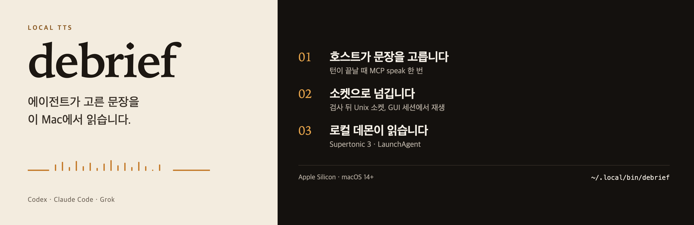

# debrief onboarding



debrief speaks text prepared by Codex, Claude Code, or Grok. A headless daemon plays the audio. Agents call MCP `speak`. Repair and host wiring can use MCP `install` or the shell install command. The Korean usage guide is [README.md](README.md).

## First installation

Version `0.1.0`. Install from Homebrew, then finish setup with `debrief install`:

```sh
brew install sparktype/tap/debrief
debrief install
# debrief install --claude
# debrief install --grok --repair
```

A source build needs the Rust toolchain (`rustup`):

```sh
git clone https://github.com/sparktype/debrief.git
cd debrief
cargo build --release
env -u HF_HUB_OFFLINE ./target/release/debrief install
```

`debrief install` copies the executable to `~/.local/bin/debrief`. LaunchAgent starts that path, so playback works even when the shell cannot see `debrief`. The CLI commands below need `~/.local/bin` on `PATH`. The tap still has `Formula/chorus.rb` for tag `v0.0.1`, which builds the previous `chorus` binary.

After `debrief install`:

1. Wait for the pinned Supertonic 3 model download and checksum verification.
2. LaunchAgent starts `debrief daemon` (or run `debrief start`).
3. Confirm MCP server `debrief` is registered for your host(s).
4. **Claude Code:** restart the app so `mcp__debrief__speak` and `mcp__debrief__install` appear. Skills: `~/.claude/skills/debrief-{setup,install,speak}`.
5. **Grok:** run **`/mcps`** so `debrief__speak` and `debrief__install` appear. Skills: `~/.grok/skills/debrief-{setup,install,speak}`. Use `search_tool` / `use_tool` when the host requires it.
6. **Codex:** review start-family hooks in `/hooks`; MCP lives in `~/.codex/config.toml`.
7. At the end of a user-visible turn the agent speaks once via MCP `speak`: what changed, then one next action. Silence only when the turn adds nothing new.

Repair without wiping unrelated host settings:

```sh
debrief install --repair
# or, when MCP already works:
#   Claude: mcp__debrief__install  { "hosts": ["claude"], "repair": true }
#   Grok:   debrief__install       { "hosts": ["grok"], "repair": true }
```

## Daily use

```sh
debrief status
debrief mode [normal|focus|quiet|verbose|night]
debrief mute [on|off|toggle]
debrief companion [on|off|toggle]
debrief doctor
debrief start
debrief stop
```

- **Mode** — `normal` (default); `focus` / `quiet` / `night` suppress `priority=subagent`; quiet/night also lower volume ceilings; `verbose` includes subagent speech
- **Mute** — pause or restore speech
- **도우미 음성** — `debrief companion` turns companion-lane speech on or off (work lane still plays when mute is off)
- **doctor** — findings, including MCP wiring. The first matching recovery is `debrief install --repair` or `debrief start`
- **start / stop** — bootstrap an existing LaunchAgent, or disable and bootout it. Stop keeps the binary and the plist

Agents call MCP `speak`. Hosts spawn `~/.local/bin/debrief mcp` after install. `debrief speak` is not a command.

## Configuration

Playback policy lives in `~/Library/Application Support/debrief/config.json`. The daemon reloads it on every utterance. Change it with the CLI. An invalid value is rejected before the file changes. A file that cannot be decoded falls back to defaults for that utterance: mode `normal`, mute off, companion on.

```sh
debrief mute on
debrief mode focus
debrief companion off
```

| Key | Command |
| --- | --- |
| `muted` | `debrief mute [on\|off\|toggle]` |
| `mode` | `debrief mode [normal\|focus\|quiet\|verbose\|night]` |
| `companionEnabled` | `debrief companion [on\|off\|toggle]` |

`volumeCeilings`, `categoryVoices`, and `voiceSpeeds` are stored in the same file. The CLI does not edit those maps. Playback uses the voice on each `speak` call. Companion playback follows the session rotation in `session-voices.json`. Work-lane role voices are the catalog in the README.

Host wiring is separate. `debrief install` writes absolute paths. `debrief install --repair` rewrites owned files and leaves a file alone when its digest no longer matches the install manifest.

| Host | Where | After install |
| --- | --- | --- |
| Claude Code | `~/.claude.json` | `mcpServers.debrief`. Restart Claude. |
| Claude Code | `~/.claude/settings.json` | start-family hooks |
| Claude Code | `~/.claude/skills/debrief-*` | setup, install, speak |
| Codex | `~/.codex/config.toml` and `~/.codex/hooks.json` | MCP plus hooks. Trust them in `/hooks`. |
| Codex | `~/.agents/skills/` | the same three skills |
| Grok | `~/.grok/config.toml` | `[mcp_servers.debrief]`. No hooks. Run `/mcps`. |
| Grok | `~/.grok/skills/` | the same three skills |

Limit a repair to one host with `--claude`, `--codex`, or `--grok`. When MCP already works, call `install` with `{ "hosts": ["claude"], "repair": true }`.

## Agent rules (all hosts)

- Spoken text is the agent’s job. At the end of each user-visible turn, speak once: **what changed**, then the one **next action** or wait.
- After writing, changing, or analyzing code, the next action names what you must verify yourself (behavior change, deletion, security or data path, an assumption, how to check or undo), so you keep code ownership and cognitive debt stays low. Trivial changes and subagents skip this.
- **Silence only** if nothing new and no next action. No file lists or checklists.
- Always pass `voice`, `speed`, and `volume`. Optional: `priority` (`main` default / `subagent`), `lane` (`companion` default / `work`), `emotion` (closed enum; prosody only), `session` (host session id; keeps the companion voice).
- Companion voice rotates across F1–M5, one voice per session. Pass `session` with the host session id so that chat keeps its voice. Speed ~0.93, volume ~0.85. Work lane keeps the voice you pass. Subagents do not brief the user; if they speak, `priority=subagent` and `lane=work`, one fact.
- Do not put speech JSON or HTML comments in the chat body.
- Mute, mode, companion, and diagnostics: `debrief mute`, `debrief mode`, `debrief companion`, `debrief doctor`.
